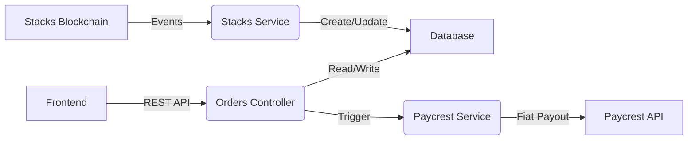

# ClovaPay Backend

Backend service for ClovaPay OFF-RAMP, built with NestJS. Handles order processing, Stacks blockchain event listening, and Paycrest fiat settlement integration.

## Features

- **Stacks Integration**: Listens for on-chain events (`order-created`, `order-confirmed`).
- **Paycrest Integration**: Bridges crypto to African fiat rails.
- **Orders API**: RESTful endpoints for order management.
- **Database**: Prisma ORM with SQLite (dev) / Postgres (prod).

## Architecture



## Getting Started

### Prerequisites

- Node.js v18+
- Docker (optional, for Postgres)

### Installation

```bash
npm install
```

### Running the app

```bash
# development
npm run start

# watch mode
npm run start:dev

# production mode
npm run start:prod
```

## Environment Variables

Copy `.env.example` to `.env`:

```bash
DATABASE_URL="file:./dev.db"
STACKS_API_URL="https://api.testnet.hiro.so"
CONTRACT_ADDRESS="ST1PQHQKV0RJXZFY1DGX8MNSNYVE3VGZJSRTPGZGM"
PAYCREST_API_KEY="your_api_key"
PAYCREST_SECRET="your_webhook_secret"
```
