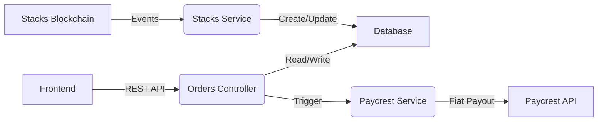

# ClovaPay Backend

Backend service for ClovaPay OFF-RAMP, built with NestJS. Handles order processing, Stacks blockchain event listening, and Paycrest fiat settlement integration.

## Version
v1.1.0

## Features

- **Stacks Integration**: Listens for on-chain events (`order-created`, `order-confirmed`).
- **Paycrest Integration**: Bridges crypto to African fiat rails.
- **Orders API**: RESTful endpoints for order management.
- **Rate Limiting**: Protects against abuse with throttling.
- **Admin Guards**: API key authentication for admin endpoints.
- **Database**: Prisma ORM with SQLite (dev) / Postgres (prod).

## Architecture



## API Endpoints

### Orders
| Method | Endpoint | Description |
|--------|----------|-------------|
| GET | `/orders` | List all orders |
| GET | `/orders/:id` | Get order by ID |
| GET | `/orders/user/:address` | Get user's orders |
| POST | `/orders/process/:id` | Mark order as processing |
| POST | `/orders/confirm/:id` | Confirm order settlement |

### Health
| Method | Endpoint | Description |
|--------|----------|-------------|
| GET | `/health` | Health check |

## Getting Started

### Prerequisites

- Node.js v18+
- Docker (optional, for Postgres)

### Installation

```bash
npm install
npx prisma generate
npx prisma db push
```

### Running the app

```bash
# development
npm run start:dev

# production mode
npm run start:prod
```

## Testing

```bash
# unit tests
npm run test

# e2e tests
npm run test:e2e

# test coverage
npm run test:cov
```

## Environment Variables

Copy `.env.example` to `.env`:

```bash
DATABASE_URL="file:./dev.db"
STACKS_API_URL="https://api.testnet.hiro.so"
CONTRACT_ADDRESS="ST1PQHQKV0RJXZFY1DGX8MNSNYVE3VGZJSRTPGZGM"
PAYCREST_API_KEY="your_api_key"
PAYCREST_SECRET="your_webhook_secret"
ADMIN_API_KEY="your_admin_api_key"
```

## License
MIT
